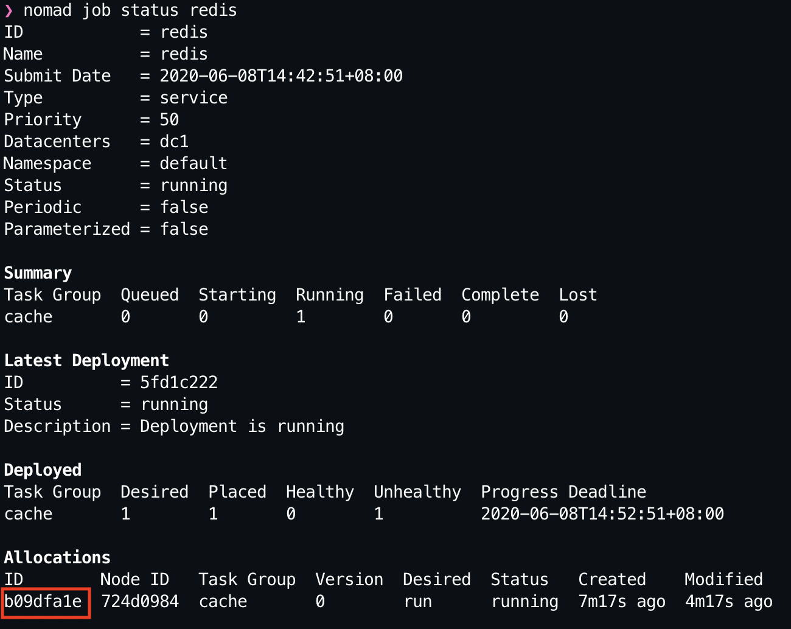
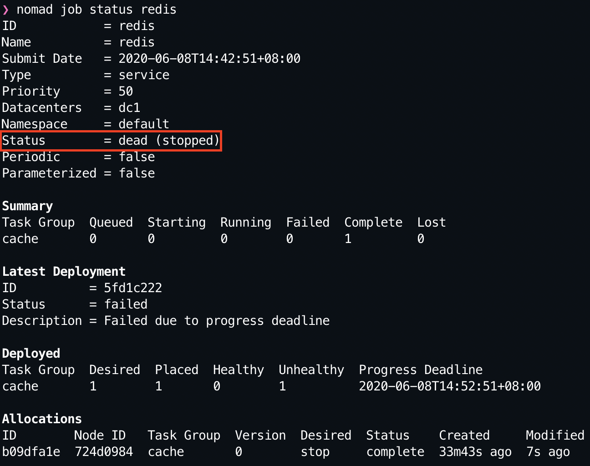

# Hashicorp Nomad

> A collection of dabbling with Hashicorp Nomad.

### Getting Started

#### Setting Up Nomad

1. Download the Hashicorp Nomad's binary client as per your OS distribution [here](https://www.nomadproject.io/downloads/)

2. Extract the binary and move it to your executable directory.
```
$ unzip nomad_${VERSION}_${OS_BINARY}_${OS_ARCH}.zip
$ mv nomad /usr/local/bin/nomad
```

3. Start the agent in dev mode as this will be running locally in your machine (not the recommended for production usage). 

```
$ sudo nomad agent -dev

# OSX users: make sure to blacklist the JVM driver to prevent the constant pop-up dialog box

$ sudo nomad agent -dev -config=osx-driver-blacklist
```

**Note:** Please run nomad agent as `sudo` since it uses operating system primitives for resource isolation which require elevated permissions.

#### Running A Job

1. Generate a skeleton `Job` for Nomad to schedule tasks.
```
$ nomad job init
```

**Note:** Jobs can be written in JSON which can be evaluated using Open Policy Agent in a pipeline as part of a guardrails mechanim.

2. Run the job and apply it for Nomad to schedule it.
```
$ nomad job run jobs/redis.nomad
```

3. Check the status of the job deployed by Nomad.
```
$ nomad status job redis
```

4. To inspect the allocation of the `redis` job that we deployed, we can obtain the `allocation id` as seen below in the screenshot:



5. Run the following command  to have Nomad report the state of the allocation as well as its current resource usage.
```
$ nomad alloc status $ALLOCATIONS_ID
```

**Note:** Additional resource usage details can be obtained by passing the `-stats` flag.

6. The logs of a task can be diplayed via the following command:
```
$ nomad alloc logs $ALLOCATIONS_ID redis
```

#### Modifying A Job

> The definition of a job is not static, and is meant to be updated over time. You may update a job to change the docker container, to update the application version, or to change the count of a task group to scale with load.


#### Stopping A Job

1. A running job can be stopped which should be part of an ideal lifecycle with the following command:
```
$ nomad job stop redis
```

2. Querying the job status, it will be marked as dead (stopped) -- indicating that the job has been stopped and Nomad is no longer running it.



3. If the job is required to run again, we can simply execute the `run` command again:
```
$ nomad run job jobs/redis.nomad
```